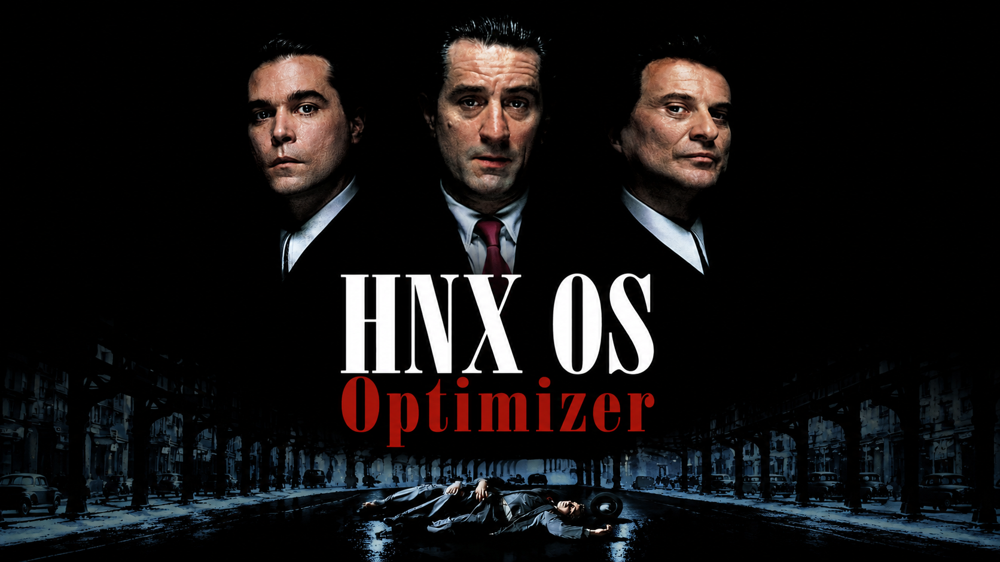

# HNX OS Optimizer ⚡



### 📥 [HNXOSOptimizer.exe Doğrudan İndir (811 KB) / Direct Download](HNXOSOptimizer.exe?raw=true)
* **TR:** Bu hafif sürümün çalışabilmesi için bilgisayarınızda **.NET 10.0 Desktop Runtime** yüklü olmalıdır. Çalıştırırken `background.png` dosyasını EXE ile aynı klasörde tutmayı unutmayın.
* **EN:** This lightweight version requires **.NET 10.0 Desktop Runtime** installed. Do not forget to keep `background.png` in the same directory as the EXE.

---

## 🇹🇷 Türkçe Belgelendirme

HNX OS Optimizer, Windows 10 ve 11 işletim sistemlerini oyun ve genel masaüstü performansı için maksimum düzeyde optimize eden, modern, animasyonlu ve stabil C# WPF uygulamasıdır. Proje, tamamen yerel Windows API'leri, PowerShell komutları ve Kayıt Defteri (Registry) yöntemleri kullanılarak sıfırdan geliştirilmiştir.

Uygulamanın en önemli özelliği, yapılan tüm optimizasyon işlemlerinin yedeklenip istendiği takdirde **Geri Alma Merkezi** üzerinden güvenle geri yüklenebilmesidir.

### 🎨 Tasarım ve Arayüz Özellikleri
- **Koyu Tema & Modern Akrilik Arayüz:** Gözü yormayan renk paleti (`Blue-Violet` ve `Neon Pink` tonları).
- **Program Klasöründen Okunan Arka Plan:** Programın çalıştığı dizindeki `background.png` dosyası otomatik olarak yüklenip şık bir akrilik filtre ile arka plan olarak kullanılır.
- **Yumuşak Geçişler ve Animasyonlar:** Sayfa geçişleri sırasında yumuşak fade/slide animasyonları, butonlarda hover tepkimeleri ve işlem sırasında dalgalı efekt yapan modern animasyonlu ProgressBar.
- **Sol Kenar Menüsü:** Simgeli ve başlık açıklamalı modern navigasyon sistemi.

### 🛠️ Temel Özellikler

#### 1. Performans
* **Güç Planı Seçici:** Güç Tasarrufu, Dengeli, Yüksek Performans ve Nihai Performans planları arasında geçiş.
* **Gereksiz Hizmetleri Kapatma (Toggle):** SysMain (Superfetch), DiagTrack (Müşteri Deneyimi Teşhisi), dmwappushservice (WAP İtme), WSearch (Arama İndeksleme), Xbox Live Hizmetleri, Print Spooler, BITS ve Windows Update servislerini devre dışı bırakabilme.
* **Görsel Efektleri Kapatma:** Pencere animasyonlarını, şeffaflıkları, Aero Peek ve Aero Shake özelliklerini kapatarak CPU ve RAM üzerindeki yükü sıfırlama.
* **Windows Game Mode & GPU Önceliği:** Windows Oyun Modu'nu aktifleştirme ve foreground (ön plan) uygulamaları için GPU önceliğini yükseltme (`Win32PrioritySeparation=38`).
* **HPET & Core Parking:** Yüksek Hassasiyetli Olay Süreölçerini (HPET) kapatma ve Core Parking limitlerini kaldırarak işlemci çekirdeklerini maksimum uyanıklıkta tutma.
* **GPU MSI Mode:** Ekran kartları için Message Signaled Interrupts (MSI) modunu aktif ederek gecikmeleri düşürme.

#### 2. Gizlilik
* **Telemetri Seviyesi Kaydırıcısı (Slider):** Teşhis verilerini 0 (Sadece Güvenlik) ile 3 (Tam Veri Gönderimi) arasında ayarlayabilme.
* **Telemetri / İzleme Kapatıcılar:** Cortana sesli asistanı, Windows 11 Copilot entegrasyonu, OneDrive eşitlemesi, Edge ve Office arka plan telemetrileri, Reklam Kimliği takibi, Konum Hizmetleri ve Windows Geri Bildirim Sıklığı anketlerini devre dışı bırakabilme.

#### 3. Ağ & İnternet
* **DNS Değiştirici:** Hazır listeden Google, Cloudflare, Quad9, OpenDNS, AdGuard DNS adreslerini tek tıkla tanımlayabilme veya özel DNS IP'leri girebilme.
* **TCP Optimizasyonları:** Nagle's Algorithm (TCP No Delay) kapatarak oyunlarda pingi düşürme, TCP Window boyutunu otomatik optimize etme ve Windows'un rezerve ettiği %20 QoS limitini kaldırma.
* **DNS Önbelleği Temizleme:** Bağlantı hatalarını düzeltmek için DNS resolver önbelleğini sıfırlama.
* **Hosts Dosyası Düzenleyici:** Entegre metin kutusu aracılığıyla hosts dosyasını görüntüleme, doğrudan düzenleyip kaydetme veya yedekten geri dönme.
* **Ping & Shodan.io Sorgulama:** IP/Host adreslerine ping atma veya Shodan InternetDB API üzerinden açık port ve zafiyet kontrolü yapabilme.

#### 4. Temizlik
* **Sistem Çöpü Temizleyici:** Temp klasörleri, Prefetch (Ön yükleme) dizini, Windows Update indirme önbelleği ve Geri Dönüşüm Kutusu'nu temizleme.
* **Metro (UWP) Uygulama Kaldırıcı:** Cortana, OneDrive, Xbox, Skype, Hava Durumu, Mail gibi yerleşik Windows uygulamalarını listeleme ve kaldırma.
* **Başlangıç Yöneticisi:** Windows açılışında otomatik çalışan kayıt defteri ve başlangıç klasöründeki programları listeleme ve kaldırma.

#### 5. Ek Araçlar
* **Kayıt Defteri Düzeltici:** Bozuk dosya uzantı ilişkilendirmelerini ve geçersiz Explorer MRU (geçmiş) kayıtlarını tarayıp düzeltme.
* **Sağ Tık Menü Düzenleyici:** Masaüstüne "Komut Penceresi Aç", "Not Defteri ile Aç", "PowerShell Aç" kısayollarını ekleme veya kaldırma.
* **PATH Değişkenleri Editörü:** Sistem PATH yollarını listeleme, silme ve yenilerini ekleme.
* **Donanım İnceleme:** WMI gerektirmeden hızlıca işlemci (CPU), ekran kartı (GPU), RAM, depolama diskleri ve Windows mimari detaylarını okuma.
* **Dosya Kilidi Çözücü:** Restart Manager API kullanarak kilitli dosyaları hangi arka plan programının kullandığını bulma ve kilidi kaldırma.

#### 6. Geri Alma Merkezi (Rollback Center)
* Yapılan tüm optimizasyon adımları tarih, saat ve durum bilgisiyle loglanır.
* **Yedekten Tümünü Geri Yükle** seçeneği ile yapılan sistem ayarları eski haline getirilir.
* **Sistem Geri Yükleme Noktası:** Her kritik işlemden önce otomatik olarak oluşturulur.
* **Yedekler Dizini:** `C:\HNX_Backup\` (Kayıt Defteri, DNS, Servis başlangıç durumları ve Hosts dosyası burada JSON ve .bak formatında saklanır).

### 💻 Teknik Gereksinimler & Kurulum
- **Platform:** Windows 10 / 11 (x64)
- **Framework:** .NET 10.0
- **Yetki:** Sistem seviyesinde değişiklik yapabilmesi için uygulamanın **Yönetici Olarak (Administrator)** çalıştırılması zorunludur.

### Derleme (Build)
Proje klasörüne komut satırından (CMD / PowerShell) girerek aşağıdaki komutla derleyebilirsiniz:
```bash
dotnet build -c Release
```

---

## 🇬🇧 English Documentation

HNX OS Optimizer is a modern, animated, and stable C# WPF utility designed to optimize Windows 10 and 11 operating systems for maximum gaming and general desktop responsiveness. Built from scratch using native Windows APIs, PowerShell scripts, and Registry modifications.

The most critical feature of the application is the **Rollback Center**, which safely backs up and restores all performed tweaks.

### 🎨 Visual & UI Features
- **Dark Theme & Modern Acrylic UI:** Eye-pleasing color palette using `Blue-Violet` and `Neon Pink` accents.
- **Dynamic Background Image:** Automatically reads `background.png` from the application directory and applies a high-end acrylic blur.
- **Smooth Animations:** Fluid fade and slide transitions between pages, hover effects, and a dynamic wave-animated ProgressBar.
- **Sidebar Navigation:** Icon-based navigation with secondary descriptive headers.

### 🛠️ Key Features

#### 1. Performance
* **Power Scheme Selector:** Instantly switch between Power Saver, Balanced, High Performance, and Ultimate Performance.
* **Service Optimizer (Toggle):** Disable resource-heavy services like SysMain, DiagTrack, dmwappushservice, WSearch, Xbox Services, Print Spooler, BITS, and Windows Update.
* **Visual Effects Adjustments:** Turn off window animations, transparency, Aero Peek, and Aero Shake to free up CPU and RAM.
* **Windows Game Mode & GPU Priority:** Toggle Game Mode and set GPU priority separation for foreground applications (`Win32PrioritySeparation=38`).
* **HPET & Core Parking:** Disable High Precision Event Timer (HPET) and eliminate CPU core parking limits for maximum processor responsiveness.
* **GPU MSI Mode:** Enable Message Signaled Interrupts (MSI) mode for graphic cards to minimize hardware latency.

#### 2. Privacy
* **Telemetry Level Slider:** Configure diagnostic telemetry levels between 0 (Security Mode) and 3 (Full diagnostics).
* **Telemetry / Tracking Blockers:** Disable Cortana, Windows 11 Copilot, OneDrive syncing, Edge & Office diagnostic metrics, Advertising ID tracking, Location Services, and Feedback Frequency prompts.

#### 3. Network & Internet
* **DNS Changer:** Apply predefined DNS servers (Google, Cloudflare, Quad9, OpenDNS, AdGuard) or specify custom primary/secondary DNS.
* **TCP Tuning:** Turn off Nagle's Algorithm (TCP No Delay) for lower gaming latency (ping), automatically tune TCP window size, and disable Windows QoS 20% reserved bandwidth.
* **DNS Flusher:** Clear the local DNS resolver cache to fix connection stability issues.
* **Hosts File Editor:** View, edit, save, or revert the Windows hosts file using an integrated text editor.
* **Ping & Shodan.io Lookup:** Ping hosts or scan open ports and CVE vulnerabilities using the Shodan InternetDB API.

#### 4. System Cleaner
* **Junk Cleaner:** Safely clean Temp files, Prefetch cache, Windows Update cache, and Recycle Bin.
* **UWP App Uninstaller:** List and uninstall bloatware (Cortana, OneDrive, Xbox, Skype, Weather, Mail) to save system resources.
* **Startup Manager:** Inspect and remove startup registry keys and folder entries.

#### 5. Additional Tools
* **Registry Fixer:** Clean up broken file associations and explorer MRU history keys.
* **Context Menu Editor:** Toggle "Open Command Window Here", "Open with Notepad", and "Open PowerShell Here" on desktop/folder context menus.
* **PATH Variables Editor:** Manage system environment PATH entries easily.
* **Hardware Inspector:** Read CPU, GPU, RAM capacity, system drives, and OS details dynamically without relying on WMI query latency.
* **File Lock Finder:** Locate locking handles of undeletable files using the Windows Restart Manager API and terminate locking processes.

#### 6. Rollback Center
* Every optimization step is logged with timestamp, action name, and status.
* **Restore All Backups:** Revert all registry and service changes to their pre-optimized state.
* **System Restore Point:** Automatically created before executing critical modifications.
* **Backup Directory:** `C:\HNX_Backup\` (Saves registry files, DNS states, hosts backups in JSON and .bak formats).

### 💻 Technical Requirements & Installation
- **Platform:** Windows 10 / 11 (x64)
- **Framework:** .NET 10.0
- **Permissions:** **Run as Administrator** is required to execute system tweaks. Gömülü `app.manifest` automatically requests elevation on startup.

### How to Compile (Build)
Navigate to the project folder via CMD/PowerShell and run:
```bash
dotnet build -c Release
```

---

## 👤 Developer & Contact / Geliştirici ve İletişim
- **GitHub:** [Henox77](https://github.com/Henox77)
- **Instagram:** [@efeyylw](https://instagram.com/efeyylw)
